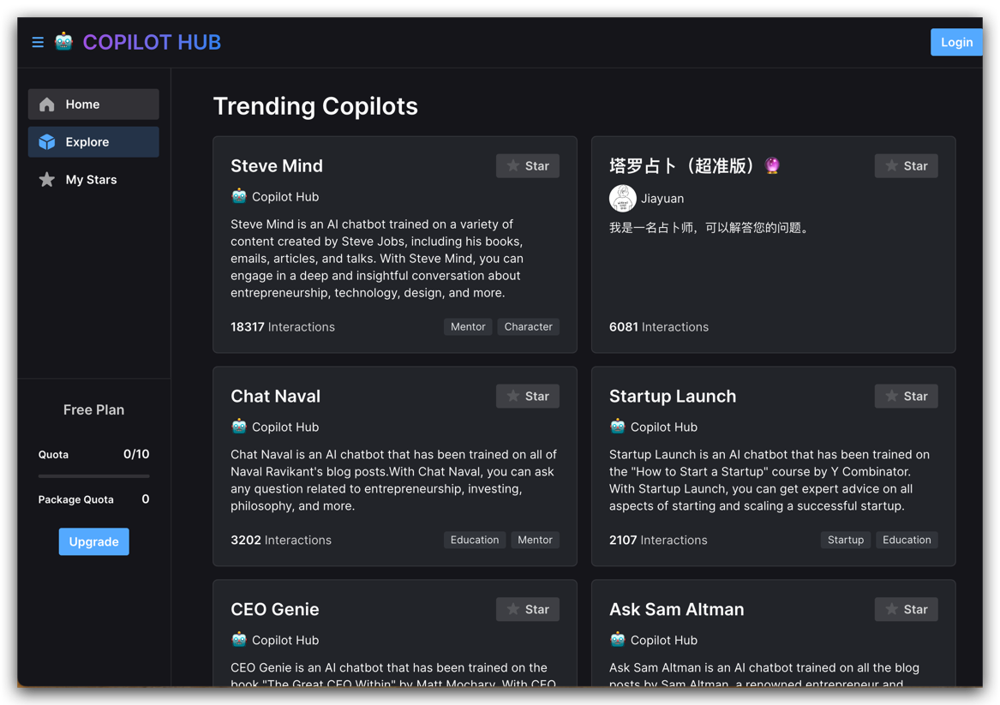

### 转换模型

**音频转动画**：
GeneFace++：通用稳定的实时音频驱动3D人脸动画技术（使用NeRF渲染），口型，表情和头部运动都可以实时跟进语音进行反馈。连接地址：https://genefaceplusplus.github.io/
--- 

**音频转文本** : Plaud AI

🎙️ 自动语音转写  
📝 重点内容总结  
🚀 操作简单方便  
💬 带时间戳文稿  
👍 在线直接使用

还能通过 ChatGPT 生成内容总结
连接：https://plaud.ai/transcribe

---
**文字转语音** ：so-vits-svc
https://github.com/RVC-Project/Retrieval-based-Voice-Conversion-WebUI

---

### 本地化部署模型

搭建私人知识库GPT Copilot Hub 是一个帮助你基于私有数据创建智能知识库 & 人格化 AI 的平台。你可以基于文档、网站、Notion
database 或其他数据源在几分钟内创建一个自定义的 ChatGPT。

平台上已经预训练了一些 AI，例如：

- 基于 Steve Jobs 传记、演讲、书信训练的 Steve Mind AI，可以以 Steve Jobs 的视角来回答你的问题
- 基于 How to Start a Startup 这门课的语料训练的 Startup Launch 创业导师，可以回答任何关于创业的问题

目前对免费用户仅开放了单文件上传的数据源，可以选择对应的文档上传，Copilot Hub
会自动在云端进行解析。[https://app.copilothub.ai/copilots](https://app.copilothub.ai/copilots)

---

直接在手机本地运行大语言模型！
MLC LLM 是一种通用解决方案，允许将任何语言模型本地部署在各种硬件后端和本地应用程序上，并提供一个可以进行模型优化的高效框架。”手机目前只支持iPhone，电脑支持Mac，Windows
pc，Linux，还支持浏览器Web GPU https://mlc.ai/mlc-llm/

---

